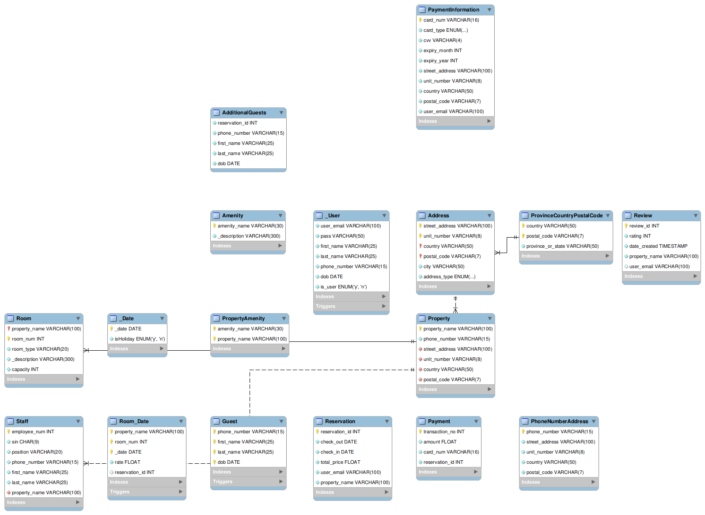

# REST API - Hotel Management System

Wellcome to the hotel management system API.

## Installation

Use the package manager [npm](https://www.npmjs.com/) to install the
dependencies.

```bash
npm install
```

To run on dev mode:

```bash
npm run dev
```

To generate the documentation:

```bash
npm run swagger-autogen
```

To visit the documentation go to:

```bash
http://localhost:3000/api-docs/
```

## Data schema



### Data installation for local use

- Tools needed: [MySQL](https://www.mysql.com/),
  [MySQL Workbench](https://www.mysql.com/products/workbench/),
  [Postman](https://www.postman.com/)

- scripts to create and populate the database and tables are in the folder:
  [`./database/sql/hotel_management.sql`](database/sql/hotel_management.sql)
- scripts to configure permissions are in the folder:
  [`./database/data/Permissions.sql`](database/sql/Permissions.sql)
- scripts to generate the SPs are in the folder:
  [`./database/sql/proceduresForAssignment4.sql`](database/sql/proceduresForAssignment4.sql)

**Note:** The database is configured to run on port 3306, if you want to change
the port of the database you must change the port in the file
[`./config/config.js`](config/config.js)

- data for test

Admin user:

```json
{
  "email": "admin@ihg.com",
  "password": "password",
  "role": "admin"
}
```

Guest user:

```json
{
  "email": "abudgetde@joomla.org",
  "password": "password",
  "role": "XTT6vt"
}
```
